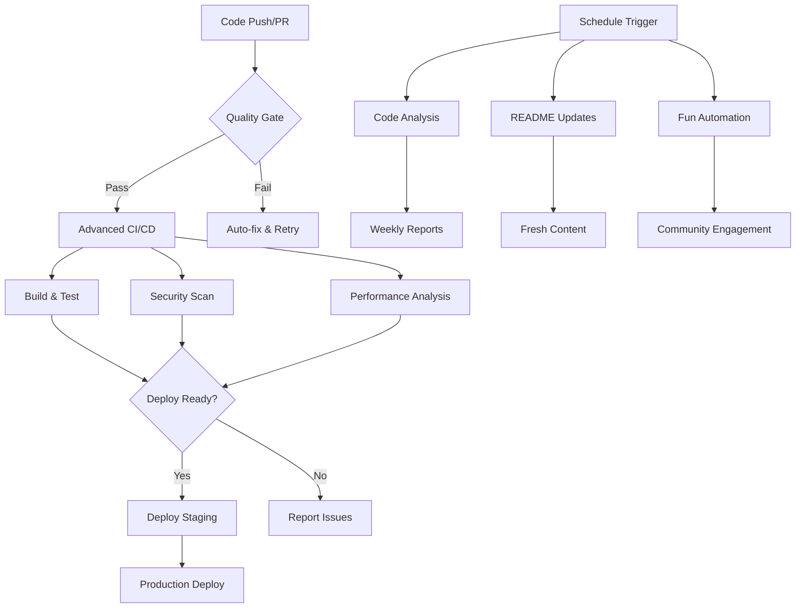

# 🚀 GitHub Actions Workflow System

> **A comprehensive automation system for modern web development**

This repository implements a sophisticated GitHub Actions workflow system that automates code quality, security, performance, documentation, and community engagement aspects of the development process.

## 📊 System Overview



## 📋 Workflow Catalog

| Workflow                  | Purpose                  | Trigger            | Frequency    | Status    |
| ------------------------- | ------------------------ | ------------------ | ------------ | --------- |
| 🔍 **Code Quality Check** | Basic quality validation | Push, PR           | On-demand    | ✅ Active |
| 🚀 **PR Check**           | Fast PR validation       | Pull Request       | On-demand    | ✅ Active |
| 🎨 **Auto Format**        | Code formatting          | Push to main       | On-demand    | ✅ Active |
| 🏗️ **Advanced CI/CD**     | Production pipeline      | Push, PR, Manual   | On-demand    | ✅ Active |
| 📊 **Code Analysis**      | Deep analysis & security | Push, PR, Schedule | Weekly       | ✅ Active |
| 📝 **README Automation**  | Content updates          | Schedule, Manual   | Daily        | ✅ Active |
| 🎮 **Fun Automation**     | Community & utilities    | Schedule, Events   | Daily/Weekly | ✅ Active |

## 🎯 Feature Matrix

### Quality Assurance

- [x] **ESLint** - JavaScript/TypeScript linting
- [x] **Prettier** - Code formatting with Tailwind sorting
- [x] **Build Testing** - Compilation and build verification
- [x] **Matrix Testing** - Multi-platform and multi-version
- [x] **Quality Gates** - Prevent poor code merging

### Security & Analysis

- [x] **CodeQL** - GitHub's semantic code analysis
- [x] **Snyk** - Vulnerability scanning for dependencies
- [x] **SonarCloud** - Code quality and maintainability
- [x] **Dependency Audit** - NPM security audit
- [x] **License Compliance** - License validation

### Performance & Monitoring

- [x] **Lighthouse CI** - Performance, accessibility, SEO
- [x] **Web Vitals** - Core web performance metrics
- [x] **Bundle Analysis** - JavaScript bundle size tracking
- [x] **Performance Budgets** - Automated performance monitoring

### Documentation & Content

- [x] **GitHub Stats** - Activity graphs and statistics
- [x] **Project Metrics** - Live code statistics
- [x] **Contributors** - Automated contributor recognition
- [x] **Auto-updates** - Daily fresh content

### Community & Engagement

- [x] **Auto-labeling** - Intelligent issue classification
- [x] **Welcome Messages** - New contributor onboarding
- [x] **Daily Inspiration** - Programming quotes and facts
- [x] **Weekly Reports** - Project activity summaries
- [x] **Dependency Updates** - Automated maintenance

## 🚀 Quick Start Guide

### 1. Basic Setup

```bash
# Clone and install
git clone <your-repo>
cd blog-application
npm run install:all
```

### 2. Configure Secrets

Add these secrets in GitHub repository settings:

```
SONAR_TOKEN          # SonarCloud integration
SNYK_TOKEN           # Security scanning
WAKATIME_API_KEY     # Coding time tracking (optional)
GH_TOKEN             # Enhanced GitHub features
```

### 3. Customize Workflows

Edit workflow files in `.github/workflows/` to match your needs:

- Update repository URLs
- Modify schedule timings
- Adjust quality thresholds
- Configure deployment targets

### 4. Enable Features

```bash
# Enable all workflows
git push origin main

# Manual trigger any workflow
gh workflow run "Workflow Name"
```

## 📈 Performance Metrics

### Typical Execution Times

| Workflow       | Duration  | Complexity |
| -------------- | --------- | ---------- |
| PR Check       | 3-5 min   | 🟢 Simple  |
| Code Quality   | 5-8 min   | 🟡 Medium  |
| Advanced CI/CD | 15-25 min | 🔴 Complex |
| Code Analysis  | 10-15 min | 🟡 Medium  |
| README Updates | 2-4 min   | 🟢 Simple  |
| Fun Automation | 1-3 min   | 🟢 Simple  |

### Resource Usage

- **Concurrent Jobs**: Up to 6 parallel jobs
- **Matrix Testing**: 6 combinations (Node.js × OS)
- **Artifact Storage**: ~500MB per build
- **Workflow Runs**: 50 kept, older auto-deleted

## 🎯 Advanced Configuration

### Custom Deployment

```yaml
# .github/workflows/ci-cd-advanced.yml
deploy-production:
  environment: production
  steps:
    - name: Deploy to AWS
      run: |
        aws s3 sync ./client/build s3://your-bucket
        aws cloudfront create-invalidation --distribution-id $DISTRIBUTION_ID
```

### Quality Gates

```yaml
# Customize quality thresholds
quality-gate:
  steps:
    - name: Check coverage
      run: |
        coverage=$(npm run test:coverage | grep "All files" | awk '{print $10}')
        if (( $(echo "$coverage < 80" | bc -l) )); then
          echo "❌ Coverage below 80%: $coverage"
          exit 1
        fi
```

### Performance Budgets

```json
// lighthouserc.json
{
  "ci": {
    "assert": {
      "assertions": {
        "categories:performance": ["error", { "minScore": 0.9 }],
        "first-contentful-paint": ["warn", { "maxNumericValue": 2000 }],
        "largest-contentful-paint": ["error", { "maxNumericValue": 4000 }]
      }
    }
  }
}
```

## 🔧 Troubleshooting

### Common Issues

**1. Workflow Permission Errors**

```bash
# Check repository permissions
Settings → Actions → General → Workflow permissions
# Set to "Read and write permissions"
```

**2. Secret Configuration**

```bash
# Verify secrets are set
Settings → Secrets and variables → Actions
# Add missing SONAR_TOKEN, SNYK_TOKEN, etc.
```

**3. Dependency Issues**

```bash
# Clear npm cache
npm cache clean --force
npm ci
```

**4. Build Failures**

```bash
# Check Node.js version compatibility
node --version  # Should match workflow matrix
npm list       # Check for dependency conflicts
```

## 📊 Monitoring & Insights

### GitHub Actions Dashboard

Access comprehensive insights at:

- **Actions Tab**: Real-time workflow status
- **Insights**: Repository analytics
- **Security**: Vulnerability alerts
- **Pulse**: Activity summary

### External Integrations

- **SonarCloud**: [your-project.sonarcloud.io](https://sonarcloud.io)
- **Snyk**: [app.snyk.io](https://app.snyk.io)
- **Lighthouse CI**: [googlechrome.github.io/lighthouse-ci](https://googlechrome.github.io/lighthouse-ci)

## 🌟 Best Practices

### Development Workflow

1. **Create Feature Branch**

   ```bash
   git checkout -b feature/amazing-feature
   ```

2. **Local Testing**

   ```bash
   npm run lint:fix
   npm run format
   npm run test
   npm run build
   ```

3. **Commit with Convention**

   ```bash
   git commit -m "feat: add amazing feature"
   ```

4. **Push and Create PR**
   ```bash
   git push origin feature/amazing-feature
   # Create PR → Workflows automatically run
   ```

### Maintenance

- **Weekly**: Review dependency updates
- **Monthly**: Update workflow actions versions
- **Quarterly**: Review and optimize performance budgets
- **Annually**: Audit security configurations

## 🚀 Future Enhancements

### Planned Features

- [ ] **Container Registry** - Docker image building and scanning
- [ ] **E2E Testing** - Cypress/Playwright integration
- [ ] **Load Testing** - K6 performance testing
- [ ] **A/B Testing** - Feature flag integration
- [ ] **Mobile Testing** - Device farm integration
- [ ] **API Testing** - Automated API contract testing

### Experimental Features

- [ ] **AI Code Review** - GPT-powered code analysis
- [ ] **Smart Rollbacks** - Automatic deployment rollback
- [ ] **Predictive Scaling** - Resource usage prediction
- [ ] **Visual Regression** - Screenshot-based testing

## 📞 Support & Contributing

### Getting Help

- 📚 **Documentation**: [workflows/README.md](./workflows/README.md)
- 🐛 **Issues**: [GitHub Issues](../../issues)
- 💬 **Discussions**: [GitHub Discussions](../../discussions)

### Contributing

1. Fork the repository
2. Create your feature branch
3. Follow the workflow conventions
4. Submit a pull request

---

<div align="center">

**🎉 Your development workflow is now supercharged!**

_Built with ❤️ using GitHub Actions and modern DevOps practices_

</div>
